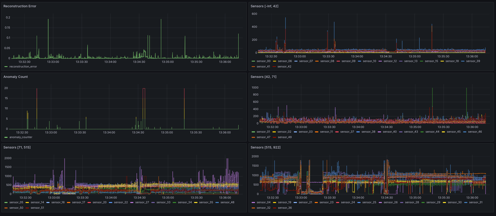
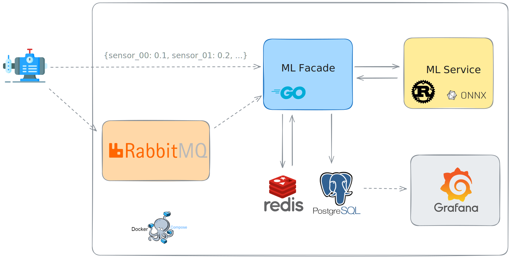

# Predictive Maintenance Showcase

Welcome to my Predictive Maintenance Showcase GitHub repository!
This project aims to demonstrate the application of real-time machine learning
in predicting equipment failures before they occur.

## :memo: Overview

In industries reliant on machinery and equipment, unexpected breakdowns
can lead to costly downtime and production losses. Predictive maintenance
offers a proactive approach by analyzing data from sensors embedded
within these assets to forecast potential failures.

For this project, I used the `pump_sensor_data` [dataset from Kaggle].
I chose this dataset because it is based on real-world data.

## :dart: Objective

The primary goal of this project is to develop a real-time predictive maintenance
system using an Autoencoder deep learning model and various real time tools and technologies.

The final output is a Docker Compose setup that runs several services to enable real-time anomaly predictions,
with a Grafana dashboard for visualization.

## :building_construction: Architecture

We have:
  - A backend app, coded in Go, primarily using the standard library.
    It can act as an Http API and return `reconstruction_error` from the machine learning service.
    The backend also listens to a RabbitMQ queue and store the data in the Postgres database.
  - An ml service app, coded in Rust, using Axum and Ort.
    It also acts as a Http API and computes the reconstruction error from a ONNX runtime.
  - A PostgreSQL database where the machine learning facade stores the data coming
    from the sensors and the machine learning model.
  - A Redis database used to:
    - Store the threshold values to determine if a reconstruction error leads to an anomaly.
    - Count the number of anomalies to assess the severity of the failure.
  - A Grafana service to monitor the data coming from the sensors and the anomalies.
  - A RabbitMQ service to send the data asynchronously using AMQP.

## :wrench: Technologies used

- [PyTorch] Autoencoder: Anomaly detection model for identifying deviations in sensor data
- [ONNX]: an open format built to represent machine learning models
- [Go] Backend Model Facade: Interface for redirecting sensor signals
  and capturing model responses
- [Axum]: Rust web application framework
- [Ort]: ONNX runtime wrapper for Rust
- [PostgreSQL]: Battle-tested database as the ML facade database
- [Redis]: used as an in-memory database for thresholds and counters
- [RabbitMQ]: used as an AMQP messaging server
- [Grafana]: used for monitoring and data visualization

## :clipboard: Project
- `data`: Where we store the data downloaded from Kaggle
- `docs`: Documentation about the project
- `grafana`: Dashboard definition and provisioning
- `ml_facade`: Golang repository with code for the ML facade backend
- `ml_model`: A Python directory to train an autoencoder model and save it as an ONNX model
- `ml_service`: Rust directory with code for the ML service backend
- `scripts`:
  - `send_data`: An asynchronous Go script that processes the initial Kaggle dataset and sends it to either
    the appropriate API route or the appropriate RabbitMQ topic
- `templates`: .env templates for easy setup

If you want to run the project, please refer to the setup instructions [here](docs/setup.md)!

## :zap: Performances

> [!NOTE]
> These tests were conducted on a local machine
> with a 13th Gen Intel® Core™ i7-1370P CPU (20 cores).

### Test Details

- Dataset Size: 220,320 records (CSV file)
- Processing Time: ~7 seconds
- Throughput: ~31,400 records per second

The performance was measured using the RabbitMQ consumer.

<!--references-->
[dataset from Kaggle]: https://www.kaggle.com/datasets/nphantawee/pump-sensor-data
[ONNX]: https://onnx.ai/
[PyTorch]: https://pytorch.org/
[Axum]: https://docs.rs/axum/latest/axum
[Ort]: https://ort.pyke.io/
[Go]: https://go.dev/
[PostgreSQL]: https://www.postgresql.org/
[Redis]: https://redis.io/
[RabbitMQ]: https://www.rabbitmq.com/
[Grafana]: https://grafana.com/
